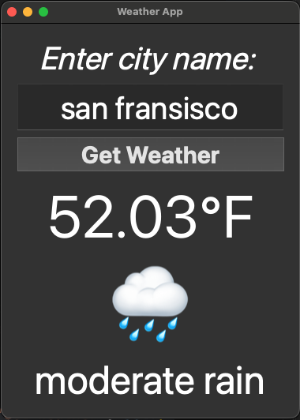

# PyQt5 Weather App

A minimal desktop **Weather App** built with **PyQt5** and the **OpenWeatherMap** API. Enter a city name, click **Get Weather**, and the app shows the current **temperature (°F)**, a weather **emoji**, and a brief **description**. Includes friendly error messages for common HTTP issues.

## Features
- 🔎 Search by **city name**
- 🌡️ Displays temperature (converted to **Fahrenheit**), plus a matching **emoji**
- 📝 Shows a short **weather description** (e.g., `light rain`)
- 🧯 Robust error handling with readable messages (400/401/403/404/5xx, connection, timeout, etc.)
- 🧩 Single-file script: `pyqt5_weather_app.py`

## Requirements
- Python 3.8+
- PyQt5
- requests
- An **OpenWeatherMap API key** (free tier available)

Install locally:
```bash
python3 -m venv .venv
source .venv/bin/activate        # macOS/Linux
# .venv\Scripts\activate       # Windows PowerShell

pip install PyQt5 requests
```

## Project structure
```
.
└── pyqt5_weather_app.py
```

## Screenshots

* Screenshot of the output for the digital clock.

## Running
1) Put your **OpenWeatherMap API key** in the code (current script uses a literal string).
2) Run:
```bash
python pyqt5_weather_app.py
```

> ⚠️ **Security tip:** Avoid committing your API key to source control. See the _Use an environment variable_ section below for a safer approach.

## How it works
- When you click **Get Weather**, the app calls:
  ```text
  https://api.openweathermap.org/data/2.5/weather?q=<CITY>&appid=<API_KEY>
  ```
- The app parses the JSON response:
  - Temperature from `data["main"]["temp"]` (Kelvin) → converted to **Celsius** and **Fahrenheit** in code; the UI shows **Fahrenheit**.
  - Weather condition from `data["weather"][0]` → emoji + text description.
- Errors are caught and displayed as readable messages in the UI.

## Screenshot
Add a screenshot image (PNG/JPG) alongside this README and reference it like so:

```md
## Screenshot

*Weather App showing city, temperature, emoji, and description.*
```

Or centered with HTML:
```html
<p align="center">
  
  <br><em>Weather App showing city, temperature, emoji, and description.</em>
</p>
```

## Customize
### Units via API (optional)
Instead of converting Kelvin manually, you can request units directly:
- Imperial (°F): append `&units=imperial`
- Metric (°C): append `&units=metric`

Example:
```python
url = f\"https://api.openweathermap.org/data/2.5/weather?q={city}&units=imperial&appid={api_key}\"
# Then read Fahrenheit directly from data["main"]["temp"]
```
